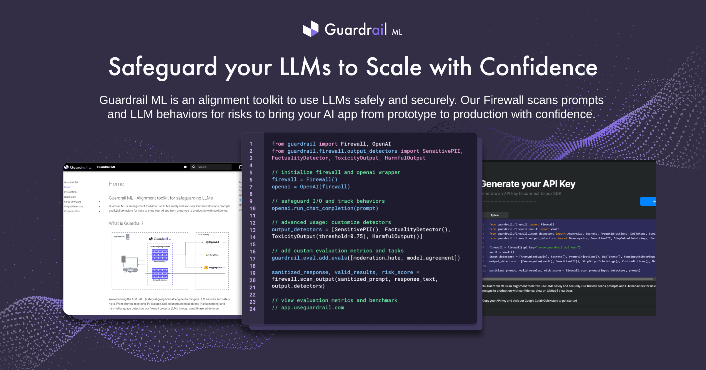

# 🛡️Guardrail ML
[](https://opensource.org/licenses/Apache-2.0)
[](https://www.python.org/downloads/release/python-370/)
[](https://github.com/psf/black)
[](https://pypi.org/project/guardrail-ml)
[](https://pepy.tech/project/guardrail-ml)
[](https://pepy.tech/project/guardrail-ml)



Guardrail ML is an alignment toolkit to use LLMs safely and securely. Our firewall scans prompts and LLM behaviors for risks to bring your AI app from prototype to production with confidence.

## Benefits
- 🚀mitigate LLM security and safety risks 
- 📝customize and ensure LLM behaviors are safe and secure
- 💸monitor incidents, costs, and responsible AI metrics 

## Features 
- 🛠️ firewall that safeguards against CVEs and improves with each attack
- 🤖 reduce and measure ungrounded additions (hallucinations) with tools
- 🛡️ multi-layered defense with heuristic detectors, LLM-based, vector DB

## Quickstart 
[](https://colab.research.google.com/drive/1eUm6tkEl9YvzgObwWDvt6pOnWgnReIug?usp=sharing)

## Installation 💻
1. Get API Key: app.useguardrail.com

2. To install guardrail, use the Python Package Index (PyPI) as follows:

```
pip install guardrail-ml
```

## More Colab Notebooks
4-bit QLoRA of `llama-v2-7b` with `dolly-15k` (07/21/23): [](https://colab.research.google.com/drive/134o_cXcMe_lsvl15ZE_4Y75Kstepsntu?usp=sharing)

Fine-Tuning Dolly 2.0 with LoRA: [](https://colab.research.google.com/drive/1n5U13L0Bzhs32QO_bls5jwuZR62GPSwE?usp=sharing)

Inferencing Dolly 2.0: [](https://colab.research.google.com/drive/1A8Prplbjr16hy9eGfWd3-r34FOuccB2c?usp=sharing)
